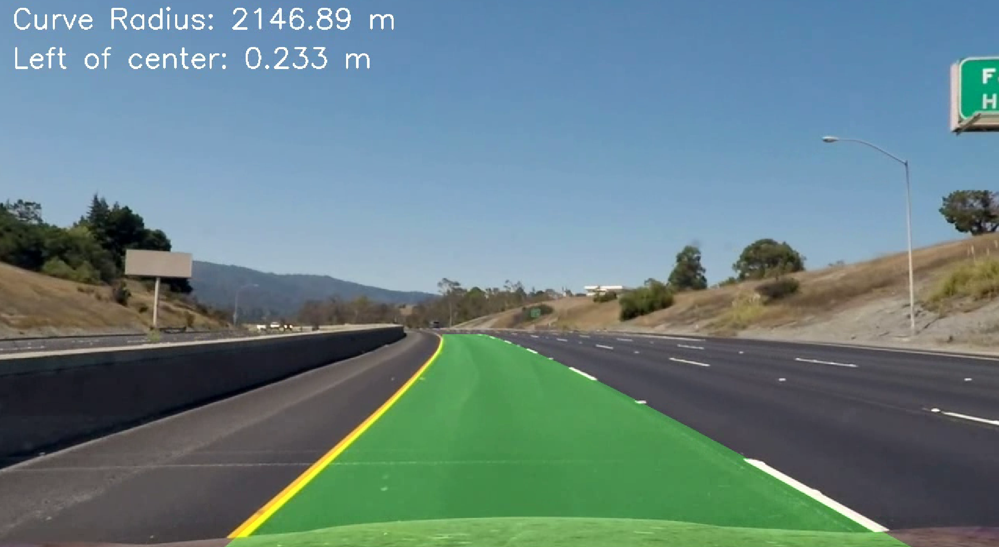

# Lane Detection Pipeline

This project implements a pipeline for detecting lane lines on the road using computer vision techniques. The pipeline processes video input, detects lane lines in each frame, and outputs an annotated video with detected lanes, curvature, and vehicle offset information.

## Project Structure

```
lane_detection_pipeline/
├── camera_calibration.py          # Camera calibration and undistortion functions
├── perspective_transform.py       # Perspective transform functions for bird's-eye view
├── binary_thresholds.py           # Thresholding functions for binary image creation
├── lane_detection.py              # Functions for lane detection and polynomial fitting
├── curvature_offset.py            # Functions to calculate curvature and offset
├── drawing_utils.py               # Drawing functions to overlay lane information on frames
├── main.py                        # Main pipeline script to process video frames
├── config.yaml                    # Configuration file for adjustable parameters
├── camera_cal/                    # Folder for camera calibration images
├── output_images/                 # Folder for storing output videos
└── test_images/                   # Folder for sample images for testing
```

### Note:
- `camera_cal`, `test_images`, and `project_video.mp4` files originate from the Udacity GitHub repository: [https://github.com/udacity/CarND-Advanced-Lane-Lines/tree/master](https://github.com/udacity/CarND-Advanced-Lane-Lines/tree/master).

## Key Modules

### 1. **Camera Calibration (`camera_calibration.py`)**
   - Contains functions to calibrate the camera and remove distortion from images.
   - Uses chessboard patterns stored in the `camera_cal` folder for calibration.

### 2. **Perspective Transform (`perspective_transform.py`)**
   - Performs perspective transformations for a bird's-eye view of the road, simplifying lane detection.
   - Includes warping and inverse warping functions based on specified source and destination points.

### 3. **Binary Thresholds (`binary_thresholds.py`)**
   - Applies various thresholding techniques to highlight lane line features, converting images to binary format.

### 4. **Lane Detection (`lane_detection.py`)**
   - Detects lanes using sliding windows, polynomial fitting, and lane tracking.
   - Locates lane pixels and fits polynomial curves to represent lane lines.

### 5. **Curvature and Offset Calculation (`curvature_offset.py`)**
   - Calculates lane curvature radius and vehicle’s offset from the lane center, providing critical lane positioning information.

### 6. **Drawing Utilities (`drawing_utils.py`)**
   - Draws lane markings, fills lane areas, and overlays curvature and offset information on frames.

### 7. **Main Pipeline (`main.py`)**
   - Integrates all modules and processes each video frame sequentially to produce the output video file.

## Configuration

The `config.yaml` file allows adjustment of key parameters across modules, enabling flexibility without modifying the code directly.

### Sample `config.yaml`:

```yaml
camera_calibration:
  nx: 9                                # Chessboard corners along x-axis
  ny: 6                                # Chessboard corners along y-axis
  calibration_pattern: 'camera_cal/calibration*.jpg'  # Path to calibration images

perspective_transform:
  src_points: [[580, 440], [700, 440], [1100, 720], [200, 720]]   # Source points for perspective transform
  dst_points: [[300, 0], [950, 0], [950, 720], [300, 720]]        # Destination points for perspective transform

binary_thresholds:
  sobel_thresh:
    orient: 'x'                       # Sobel gradient direction
    thresh_min: 30                    # Minimum threshold for Sobel
    thresh_max: 150                   # Maximum threshold for Sobel

lane_detection:
  nwindows: 9                         # Number of sliding windows for lane detection
  margin: 80                          # Window width +/- margin
  minpix: 40                          # Minimum pixels to recenter window

output:
  input_video: "test_images/input_video.mp4"     # Path to input video
  output_video: "output_images/result_video.mp4" # Path to output video
```

## Installation

### Prerequisites
- Python 3.x
- OpenCV
- NumPy
- Matplotlib
- PyYAML (for loading configuration)

### Installation Steps
1. Clone the repository:
   ```bash
   git clone https://github.com/yourusername/lane_detection_pipeline.git
   cd lane_detection_pipeline
   ```

2. Install required packages:
   ```bash
   pip install -r requirements.txt
   ```
   **Note**: Ensure the `requirements.txt` file includes all required libraries (e.g., `opencv-python`, `numpy`, `matplotlib`, `pyyaml`).

3. Place chessboard calibration images in the `camera_cal` folder.

4. Configure `config.yaml` with desired parameters.

## Usage

To run the lane detection pipeline:

```bash
python main.py
```

The script reads the input video specified in `config.yaml`, processes each frame, and saves the output video in the specified location.

### Example
1. Update `input_video` and `output_video` paths in `config.yaml` with your video file names.
2. Run the pipeline using the command above.
3. The processed video with detected lanes will be saved in the `output_images` folder.

## Results

The pipeline outputs an annotated video with:
- Detected lane markings overlaid on the road.
- Lane curvature radius and vehicle offset information displayed on each frame.

#### Example Output:
Below is an example output image saved in the `output_images` folder:



## Additional Information

- **Chessboard Images**: Required for initial camera calibration. Capture these images with the same camera to ensure calibration accuracy.
- **Perspective Transformation**: The `src_points` and `dst_points` in `config.yaml` determine the bird's-eye view transformation. Adjust these points if necessary based on your input video.

## Future Enhancements
- Support for multi-lane detection.
- Integration of a real-time lane detection model for live video streams.
- Additional image processing techniques for robustness under varied lighting conditions.

## License
This project is licensed under the MIT License. See the [LICENSE](LICENSE) file for details.
